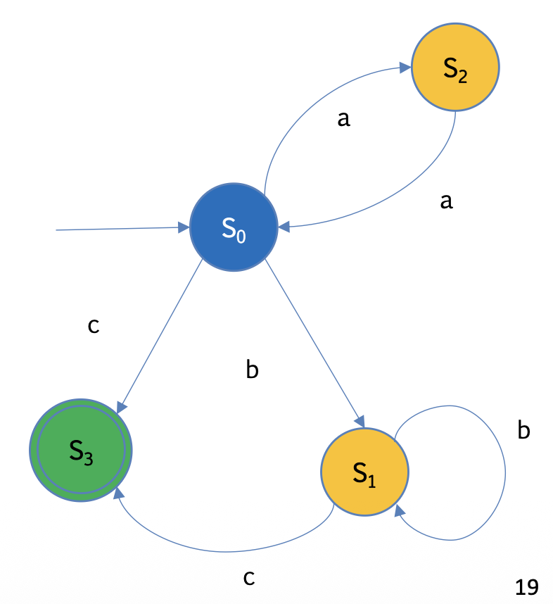

# **Software Documentation**

L’obiettivo di questo progetto è implementare una **Finite State Machine (FSM)** di **Moore** su una breadboard, utilizzando come **MCU** una **STM32L475 (B-L475E-IOT01A2)**.  
La macchina è progettata per riconoscere parole appartenenti al linguaggio:

> “Identify even sequences of `a` (even empty),
followed by one, or more, or no, `b`, ended by `c`.”

---

### **Diagramma FSM**



La macchina presenta i seguenti stati:

* **S₀ (Blue)** – Stato iniziale, anche per sequenze pari di `a`
* **S₁ (Yellow)** – Dopo una o più `b`
* **S₂ (Yellow)** – Dopo una sequenza dispari di `a`
* **S₃ (Green)** – Stato finale (parola valida, terminata da `c`)
* **Errore (Red)** – Stato di errore

L’uscita associata a ciascuno stato corrisponde al colore del LED acceso sul microcontrollore:

* Blue → GPIO 0  
* Red → GPIO 1  
* Yellow → GPIO 2  
* Green → GPIO 3

---

## **Architettura Software**

Il progetto è organizzato in **tre moduli principali**, secondo i principi di **modularità**, **astrazione** e **separazione tra logica e hardware**.

---

### **1. Main**

* Punto di ingresso del programma.  
* Deve essere unico e funzionare su qualsiasi piattaforma hardware.  
* Si occupa di:
  * Inizializzare la FSM e l’hardware (tramite HAL);
  * Leggere gli input (caratteri `a`, `b`, `c`);
  * Aggiornare lo stato della FSM;
  * Controllare eventuali errori.

---

### **2. FSM (Finite State Machine)**

* Contiene la logica della macchina di Moore.  
* Deve essere **totalmente indipendente dall’hardware**.  
* Implementa:
  * Definizione degli stati (`S0`, `S1`, `S2`, `S3`, `ERROR`);
  * Funzioni per aggiornare lo stato in base all’input;
  * Funzione per restituire lo stato corrente.

Esempio di interfaccia:

```c
/*
 * State function. Returns the following
 *   >=0 : the next state
 *   -1  : input sequence not legal
 *   -2  : we're in final state
 *   -3  : internal error
 */
int sfn(int currState, char input);

/*
 * Machine function. Moore machine.
 */
void mfn(int currState);

/*
 * Returns true if state given as input is the final state
 */
int isFinalState(int s);

/*
 * Gets next inputs, or 'x' if no inputs available.
 * WARNING: this function shifts the input, once you call it!
 */
char next();
````

---

### **3. HAL (Hardware Abstraction Layer)**

* Interfaccia tra logica e hardware.
* Deve essere **personalizzato** in base al dispositivo utilizzato.
* Fornisce funzioni per controllare i LED tramite GPIO:

```c
void hal_led_on(uint8_t gpio);
void hal_led_off(uint8_t gpio);
```

* Mappa i GPIO ai colori:

```c
#define LED_BLUE   GPIO_PIN_0
#define LED_RED    GPIO_PIN_1
#define LED_YELLOW GPIO_PIN_2
#define LED_GREEN  GPIO_PIN_3
```